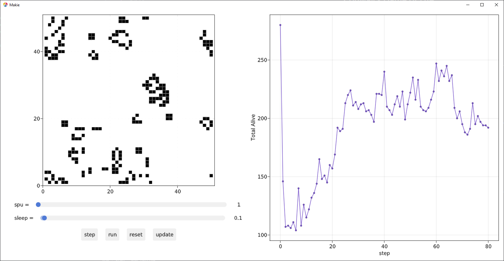

# Conway's Game of Life

Learning how agent based modelling works using [Agents.jl](https://github.com/JuliaDynamics/Agents.jl) by creating Conway's game of life. This may not be a prime example, but is still neat nonetheless.

https://user-images.githubusercontent.com/81660172/154884781-c6c7e147-a00a-4806-a741-a3a3f448420c.mp4

This was based on the [Schelling's segregation model](https://juliadynamics.github.io/Agents.jl/stable/examples/schelling/) tutorial since I did not realize the [Conway's game of life](https://juliadynamics.github.io/AgentsExampleZoo.jl/dev/examples/game_of_life_2D_CA/) tutorial existed until after I made this.

The `gameoflife.jl` file contains the main game of life code. The notebook file is a [Pluto notebook](https://github.com/fonsp/Pluto.jl) for testing and making an mp4. 

The interactive file may be the more interesting file. It uses [Makie](https://github.com/JuliaPlots/Makie.jl) through Agents.jl to create an interactive plot so you can step through each frame by hand.



Much better explanations are in the links at the bottom of the page.

## Usage
If needed, navigate to the working directory, activate, then instantiate the project environment:
```
julia> ]
pkg> activate .
pkg> instantiate
```

To run the interactive version:
```
$ julia --project=. gameoflife_interactive.jl
```

Running the Pluto notebook version requires Pluto installed in Julia.
## More to read
- [https://github.com/JuliaDynamics/Agents.jl](https://github.com/JuliaDynamics/Agents.jl)
- [https://juliadynamics.github.io/Agents.jl/stable/tutorial/](https://juliadynamics.github.io/Agents.jl/stable/tutorial/)
- [https://juliadynamics.github.io/Agents.jl/stable/examples/schelling/](https://juliadynamics.github.io/Agents.jl/stable/examples/schelling/)
- [https://juliadynamics.github.io/Agents.jl/stable/examples/game_of_life_2D_CA/](https://juliadynamics.github.io/Agents.jl/stable/examples/game_of_life_2D_CA/)
